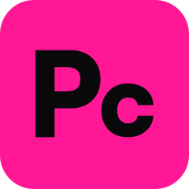
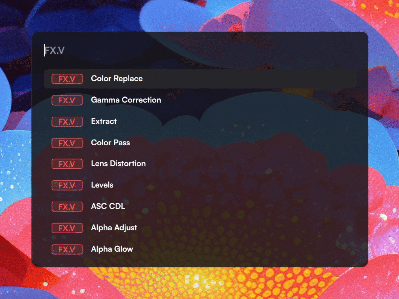
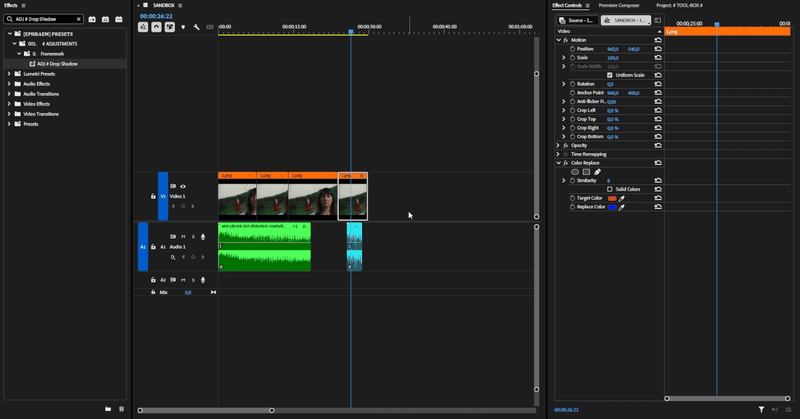
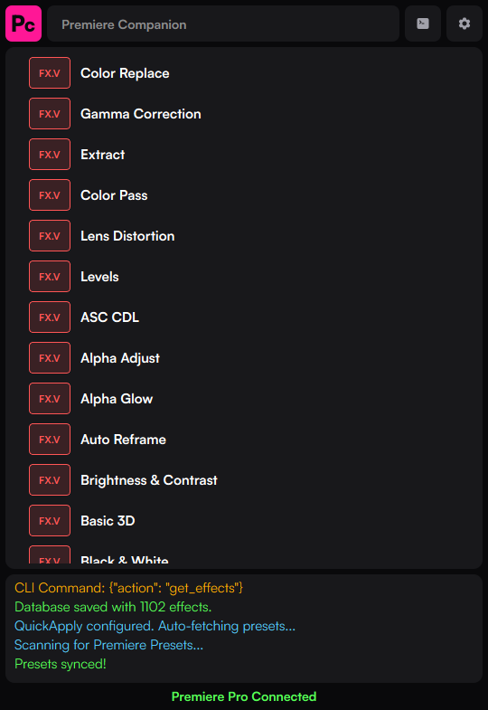

<div align="center">
  <h1 style="font-size: 3em; font-weight: 500">
  
✦ 𝐏𝐑𝐄𝐌𝐈𝐄𝐑𝐄 𝐂𝐎𝐌𝐏𝐀𝐍𝐈𝐎𝐍 ✦

  </h1>
</div>

<p align="center">
  
</p>

<p align="center">
  <a href="https://github.com/BlessEphraem/Premiere-Companion/releases">
    
  </a>
  
  <a href="https://github.com/BlessEphraem/Premiere-Companion/releases">
    
  </a>
  <a href="https://github.com/BlessEphraem/Premiere-Companion/blob/main/LICENSE">
    
  </a>
</p>

**Premiere Companion** is a productivity tool for Adobe Premiere Pro that lets you instantly apply **video effects**, **audio effects**, **transitions**, and **presets** - all from a fast, keyboard-driven search bar without ever leaving your timeline.
> Think of it as a free, open-source alternative to the Excalibur plugin, but with the added ability to apply Presets.

<p align="center">
  
</p>

<details>
  <summary>
    <b>🧩 Why "Premiere Companion" over similar plugins ?</b>
  </summary>

Unlike traditional alternatives (such as Excalibur), splitting the tool into a desktop app and a plugin brings significant advantages:
* **Blazing Fast & Reliable Hotkeys:** Shortcut detection happens globally at the OS level, bypassing Premiere's sluggish shortcut engine for a lightning-fast search bar.
* **Future-Proof (UXP API):** Built on Adobe's modern UXP architecture, perfectly adapted for the future while leaving behind the dying ExtendScript API.
* **True Preset Application (Custom Keyframes Preserved):** Other tools use code hacks that ruin complex custom animations (like Bezier curves). Companion simulates a physical drag-and-drop, applying presets natively without destroying your keyframes.
* **Free & Open-Source:** It is fully transparent, community-driven, and completely free to use.
</details>

<br/>

# ✨ Features
- **🪄 Custom Macros** - Create powerful sequences of actions (apply an effect, then a preset, then adjust opacity) and trigger them with a single click or command.
- **🖱️ Better Motion HUD** - A revolutionary way to adjust clip properties (Position, Scale, Rotation, Opacity) using mouse movements with a real-time floating HUD.
- **🔄 Better Transform** - Use the combined Transform tool to switch between Position, Scale, and Rotation on the fly using mouse button modifiers (RMB/MMB).
- **⚡ Instant Search Bar** - Summon a floating search bar from anywhere with a fully customizable shortcut (default: `Ctrl+Space`) while Premiere Pro is in focus.
- **🛠️ Dynamic Commands** - Control the application directly from the search bar (e.g., `/QA` to toggle Quick Apply, `/BM` for Better Motion).
- **⌨️ Global Hotkeys** - Assign any effect, preset, or macro to a global keyboard shortcut that works even when Premiere is focused.
- **🗂️ Category Navigation** - Use the `←` / `→` arrow keys to cycle through element categories (Transitions, Video FX, Audio FX, Presets, Macros, All).
- **🔍 Live Filtering** - Results update as you type with a smart scoring algorithm that prioritizes recently used items.
- **🎯 Preset Support (Quick Apply)** - Apply your saved Premiere Pro presets automatically using recorded mouse positions and hardware-level input simulation.
- 🎨 **Dynamic Theming** - A fully customizable UI with 40+ adjustable parameters driven by a JSON configuration file.
- **🔗 Hold-to-Sync** - Interactive logo with a progress gauge: hold for 2 seconds to force a full database synchronization.

<p align="center">
  
</p>

---

# 📋 Prerequisites
Before using Premiere Companion and the plugin, make sure you have:
- **Adobe Premiere Pro 25.6.1** or a **Beta version** that supports **UXP plugins**.

# 🚀 Installation

<p align="center">
  
</p>

### ✅ Recommended - Setup / Portable version

Choose the "setup.exe" or the "portable.zip" from the [**Releases page**](https://github.com/BlessEphraem/Premiere-Companion/releases).

<details><summary>
  <strong>🛠️ From Source - Run the `.pyw` Script</strong>
</summary>

If you prefer to run directly from source, clone this repository. Run your terminal as Administrator (required for global hotkeys and mouse simulation) and install the dependencies:
```bash
pip install PyQt6 pywin32 pyautogui websockets pynput
```
> **Optional:** `pip install win11toast` for native Windows 11 toast notifications (falls back to PowerShell automatically if not installed).

</details>


# 📖 Guides

### [✅ Recommended - How to Getting Started guide](GettingStarted.md)

Once configured, for a detailed breakdown of how to use the search bar (keyboard navigation, category filtering, transition alignment, recent items, and more) :

[](SearchBar.md)

[-f9c804?style=for-the-badge)](QuickApply.md)

[](BetterMotion.md)

[](MacrosAndHotkeys.md)

[](Commands.md)

---

# 🗺️ Roadmap & Known Issues

I am constantly adding new features! Check out our [Roadmap](ROADMAP.md) to see:
- ❌ Known limitations (e.g., UXP API limits on audio transitions).
- 🏗️ What we're currently working on (WIP).
- 🗒️ Backlog of ideas, including the upcoming **Custom Command Compositions** feature.

# 🛠️ Tech Stack
- **Language:** Python 3
- **GUI:** PyQt6
- **Communication:** `asyncio`, `websockets`
- **OS Integration (Windows):** `ctypes`, `win32gui` (Global hotkey hooking & window management), `pyautogui` (Input simulation)
- **Data Persistence:** Local JSON files for configurations, keybinds, and themes.

# 📄 License

GPL-3.0 license - see [LICENSE](LICENSE) for details.